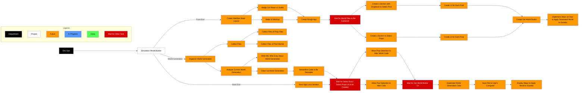

```mermaid
---
config:
  layout: dagre
---
flowchart LR
 subgraph Legend["Legend"]
        department["Department"]
        project["Project"]
        future["Future"]
        ip["In Progress"]
        done["Done"]
        wait["Wait for Other Task"]
  end
    devops["Dev Ops"] --> sim-gui["Simulation World Builder"]
    sim-gui -- Front End ---> sim-gui-ui["Create Interface Base Layout"]
    pool-picker["Create a Section with Dropdown to Select Pool"] ---> pool-display-gen["Create UI for Each Pool"]
    pool-display-gen ---> gen-button["Create Get World Button"]
    prop-picker["Create a Section to Select Props"] ---> prop-display["Create UI for Each Prop"]
    prop-display ---> gen-button
    sim-gui-ui --> n1["Weigh Out React vs Svelte"] & n3["Make UI Mockup"]
    n1 --> n4["Create Rough App"]
    n3 --> n4
    n4 --> n14["Wait for World Files to Be Gathered"]
    sim-gui -- Back End --> save-local-session["Save App Local Session"]
    sim-gui -- World Generation --> n5["Organize World Generation"]
    n5 --> n9["Collect Files"] & n10["Analyze Current World Generation"]
    n9 --> n7["Collect Files of Prop Files"] & n6["Collect Files of Pool Worlds"]
    n10 --> n11["Write MIL Wiki Entry About World Generation"] & n12["Clean Up World Generation"]
    n12 --> n13["Streamline Code to Be Reusable"]
    n14 --> pool-picker & prop-picker
    n13 --> n16["Wait for Select Pool / Select Props UI to be Created"]
    save-local-session --> n16
    n16 --> n17["Allow Prop Selection to Alter World Code"] & n18["Allow Pool Selection to Alter Code"]
    n17 --> n19["Wait for Get World Button UI"]
    n18 --> n19
    n19 --> n20["Implement World Generation Code"]
    gen-button --> n21["Implement Steps on How to Apply Generated World to Gazebo"]
    n20 --> n22@{ label: "Save File to User's Computer" }
    n22 --> n23["Display Steps to Apply World to Gazebo"]
    n22@{ shape: rect}
     department:::dep
     project:::proj
     future:::f
     ip:::i
     done:::d
     wait:::Class_03
     devops:::dep
     sim-gui:::proj
     sim-gui-ui:::f
     pool-picker:::f
     pool-display-gen:::f
     gen-button:::f
     prop-picker:::f
     prop-display:::f
     n1:::f
     n3:::f
     n4:::f
     n14:::Class_03
     save-local-session:::f
     n5:::f
     n9:::f
     n10:::f
     n7:::f
     n6:::f
     n11:::f
     n12:::f
     n13:::f
     n16:::Class_03
     n17:::f
     n18:::f
     n19:::Class_03
     n20:::f
     n21:::f
     n22:::f
     n23:::f
    classDef dep fill:#000,color:#fff
    classDef proj fill:#fff,color:#000
    classDef i fill:#59f,color:#000
    classDef d fill:#5f5,color:#000
    classDef Class_03 fill:#D50000, color:#FFFFFF
    classDef f fill:#f90, color:#000
    style n14 color:none
```
